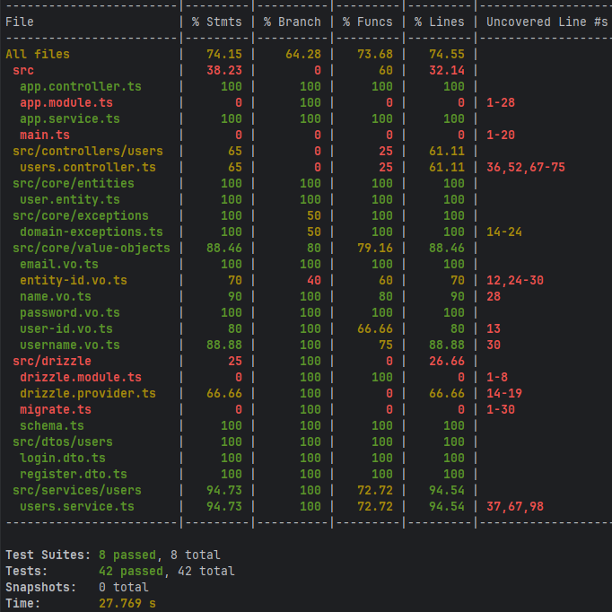

# Authy

A progressive [NestJS](https://nestjs.com/) API for user authentication, built with Domain-Driven Design (DDD) principles.

## Features

- User registration and login with JWT authentication
- PostgreSQL database integration using Drizzle ORM
- API documentation via Swagger
- Domain-Driven Design (DDD) architecture

## Domain Model

This project uses DDD concepts, including Entities and Value Objects:

### Entities

- **User** ([src/core/entities/user.entity.ts](src/core/entities/user.entity.ts))

### Value Objects

- **Email** ([src/core/value-objects/email.vo.ts](src/core/value-objects/email.vo.ts))
- **Password** ([src/core/value-objects/password.vo.ts](src/core/value-objects/password.vo.ts))
- **Name** ([src/core/value-objects/name.vo.ts](src/core/value-objects/name.vo.ts))
- **Username** ([src/core/value-objects/username.vo.ts](src/core/value-objects/username.vo.ts))

## Getting Started

### Install dependencies

```sh
npm install
```

### Run the project

```sh
npm run start:dev
```

### Run migrations

```sh
npm run db:migrate
```

### Run tests

```sh
npm run test
```

### Run tests for coverage

```sh
npm run test:cov
```

### Test Coverage




## API Documentation

Swagger UI is available at `/api` when the server is running.

## Project Structure

- `src/core/entities/` - Domain entities
- `src/core/value-objects/` - Domain value objects
- `src/services/` - Application services
- `src/controllers/` - API controllers
- `src/drizzle/` - Database schema and migrations

## Running with Docker Compose

To start the service and its dependencies (PostgreSQL and Redis) using Docker Compose:

1. Make sure you have [Docker](https://docs.docker.com/get-docker/) and [Docker Compose](https://docs.docker.com/compose/install/) installed.
2. In your project root, run:

    ```sh
    docker-compose up --build
    ```

This will:
- Build the application image.
- Start the PostgreSQL and Redis containers.
- Run database migrations automatically.
- Start the NestJS API server on port `3000`.

You can access the API at [http://localhost:3000](http://localhost:3000) and Swagger documentation at [http://localhost:3000/api](http://localhost:3000/api).

To stop the services, press `Ctrl+C` or run:

```sh
docker-compose down

## License

MIT